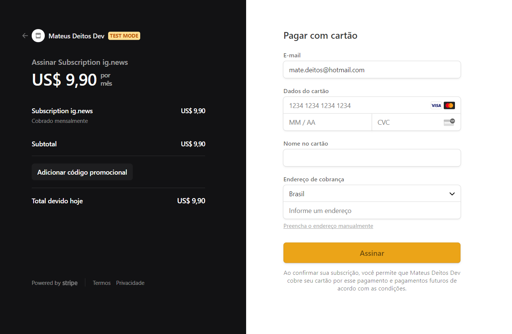

  

  

  

  <a href="https://github.com/mateusdeitos">
    
  <a>

## Description
- Blog created in Ignite Bootcamp

## Features 🚀
 - Typescript
 - React + Next.js
 - Checkout and subscription using Stripe
 - Social login using Github and FaunaDB
 - Server Side Rendering with Next.JS
 - Static Site Generation with Next.JS
 

## Screens 💻

<h4>Home</h4>
  
<h4>Checkout with Stripe</h4>
  
<h4>Posts</h4>
  
<h4>Post Preview when not subscribed</h4>
  
<h4>Post Preview when not logged in</h4>
  
<h4>Post when logged and subscribed</h4>
  

 
## Contact ✉
  - <a target="_blank" href="https://www.linkedin.com/in/mateus-campos-deitos-42688864//">LinkedIn</a>
  - <a target="_blank" href="mailto:matdeitos@gmail.com">E-mail</a>
